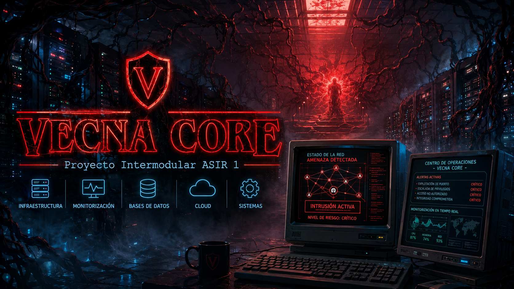

# VECNA CORE - Proyecto Intermodular ASIR 1



## Descripción del proyecto

**VECNA CORE** es una empresa ficticia creada para nuestro proyecto intermodular de **1º de ASIR**.  
La idea principal del proyecto es simular una empresa dedicada a la **ciberseguridad, administración de sistemas, monitorización de infraestructuras IT y gestión de servicios tecnológicos**.

Hemos planteado VECNA CORE como si fuese una empresa real, con una infraestructura interna formada por servidores, clientes, redes segmentadas, servicios internos, base de datos, página web corporativa y documentación técnica.

El objetivo principal ha sido unir los contenidos trabajados en diferentes asignaturas durante el curso y aplicarlos sobre una misma empresa ficticia, consiguiendo que todas las partes tengan relación entre sí.

---

## Objetivo general

El objetivo de este proyecto es diseñar una infraestructura empresarial completa y coherente, aplicando conocimientos de distintas asignaturas de ASIR.

Para ello, hemos creado una empresa ficticia que necesita:

- Una red interna organizada y segmentada.
- Servidores y servicios corporativos.
- Gestión de usuarios, equipos e incidencias.
- Una base de datos para almacenar información.
- Una web corporativa para presentar la empresa.
- Una parte relacionada con hardware y recursos físicos.
- Una aproximación al uso de servicios en la nube.

De esta manera, el proyecto no está formado por trabajos independientes, sino por diferentes partes conectadas bajo una misma idea: **VECNA CORE como empresa tecnológica de ciberseguridad y administración IT**.

---

## Idea de empresa

VECNA CORE se presenta como una empresa especializada en ofrecer servicios tecnológicos a otras organizaciones.

Sus principales áreas son:

- **Ciberseguridad**
- **Monitorización de sistemas**
- **Administración de servidores**
- **Gestión de redes empresariales**
- **Control de incidencias**
- **Soporte técnico**
- **Servicios IT para empresas**

La empresa está pensada como un entorno empresarial real, donde los sistemas deben estar disponibles, protegidos y correctamente administrados.

---

## Relación con las asignaturas

El proyecto está organizado por asignaturas. Cada una representa una parte diferente de VECNA CORE.

| Asignatura | Parte del proyecto |
|---|---|
| **Administración y Gestión de Redes** | Diseño de la red empresarial, VLANs, direccionamiento IP, routing, segmentación y seguridad mediante ACLs. |
| **Implantación de Sistemas Operativos** | Configuración de servidores, clientes, servicios de red, Active Directory, DNS, DHCP, FTP, IIS y administración del entorno. |
| **Gestión de Bases de Datos** | Diseño de una base de datos para gestionar usuarios, departamentos, equipos, servicios, incidencias, clientes, planes y facturación. |
| **Lenguaje de Marcas** | Creación de la página web corporativa de VECNA CORE usando HTML, CSS, XML, XSD y XSLT. |
| **Fundamentos de Hardware** | Análisis y justificación de los recursos físicos necesarios para la infraestructura de la empresa. |
| **Fundamentos de Computación en la Nube** | Relación del proyecto con servicios cloud, despliegue y uso de plataformas modernas para alojar o complementar la infraestructura. |

---

## Estructura del repositorio

El repositorio está dividido en carpetas según las asignaturas del proyecto:

```text
VECNACORE---Intermodular/
│
├── Admininistracion_gestion_redes/
│   └── Documentación y archivos relacionados con la red empresarial.
│
├── Fundamenos_Hardware/
│   └── Documentación relacionada con la parte física y técnica del proyecto.
│
├── Fundamentos_Computacion_Nube/
│   └── Documentación relacionada con la parte de nube.
│
├── Gestion_Base_Datos/
│   └── Modelo, documentación y desarrollo de la base de datos.
│
├── Implantacion_Sistemas_Operativos/
│   └── Documentación de servidores, clientes y servicios internos.
│
└── Lenguaje_Marcas/
    └── Página web corporativa y archivos relacionados.
